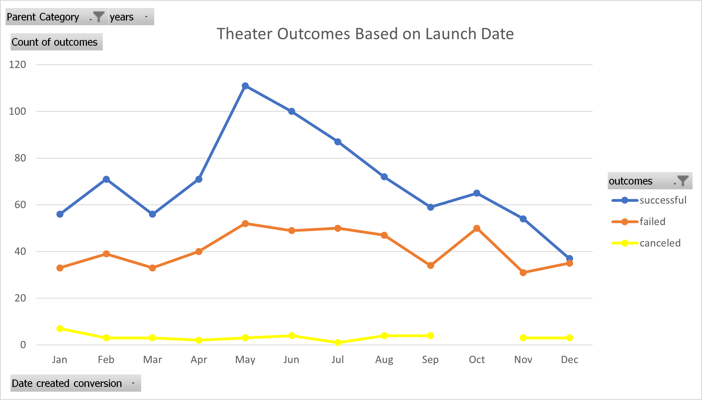

# Kickstarting with Excel
## Overview of Project
Louise is trying to raise money for her play "Fever" through crowd funding with a budget of around 10k. The purpose of this challenge is to see if the fundraiser for Louise’s play will be successful based on the data and trends from similar fundraisers that were held before. In this challenge we are trying to use excel to analyze the data by analyzing outcomes based on launch date, goals and see if we can predict the outcome for Louise’s fundraiser.

## Analysis and Challenges
### Analysis of Outcomes Based on Launch Date
In this analysis we are trying to see if the launch date for the events is making a difference in the outcome. For this, we need to create a pivot table with parent category and years as filters and rows being Date created conversion. The columns are the outcomes and values being count for outcomes. From this we create a line chart with each line representing the counts for th different outcomes (successful, failed & canceled). We further filter the parent category to "Theater" and select the years as "All" to look across different months for the theater category. 

### Analysis of Outcomes Based on Goals
We are trying to see if the outcomes chang with the goal amount. So we divide the goal amount into different ranges such as <1000$, 1000$-4999$ etc. Using "countifs" function we count how many outcomes are successful for the subcategory “plays” for each goal amount range. We repeat this for failed and canceled. Adding these sucessful, failed and canceled counts will give us a total count from which we can calculate % successful, % failed and % canceled for each goal amount range. We then create a line chart to look at the outcomes % based on the goal amount. 

### Challenges and Difficulties Encountered
The data is large and is causing the excel to crash after a certain point.  So, it was hard to modify or save the existing workbook when I add more sheets or perform more analysis. I had to remove the sheets we were not using for the final challenge to prevent it from crashing. 

## Results
### Results for outcomes based on Launch date
-Based on launch date the theater fundraisers are more scucessful during the summer months of May, June and July. 
-During the end of the year and the beginning its dropping. 
-The canceled outcomes are very less for "theater" category
Louise might be more successful if she launches her fundraiser during these summer months.

### Results for Outcomes based on Goals
Based on Goals the success rate is higher for low budget fundraisers uptil 5000$. But there are some fundraisers between 35+ to 45k which are also successful. Louise might be more successful if her budget is below 5000$. 

### Limitations of the dataset
The data has a category of "Theater" and a subcategory called "plays" but there is no information for genre. We know the success rate for plays, but we do not know the genre of the successful plays. If we know which genre plays are more successful whether its comedy or romance or thrillers etc., we can figure out even more accurately how successful Louise might be in raising money for her play.

### Possible tables and graphs 
Is the play being a staff pick more successful? For this I used countifs to count the successful plays based on whether it’s a staff pick or not. The play being a staff pick is making it 30% more succesful. So if Louises play is a staff pick she will have greater chances of success.

Also we can look at the box and whisker plots for pledged and goal amounts for the plays subcategory in US. The upper outlier range for pledged is 9525$ while Louise's budget is 10k which is higher than the outlier range of the pledged amount.The median value of the pledged is 3684.92$. Looking at this box plot, we can conclude that 10k is a very big goal amount which might be difficult to raise. Louise might have to reduce her goal amount to around 4000-5000$ for her fundraiser to be successful.

