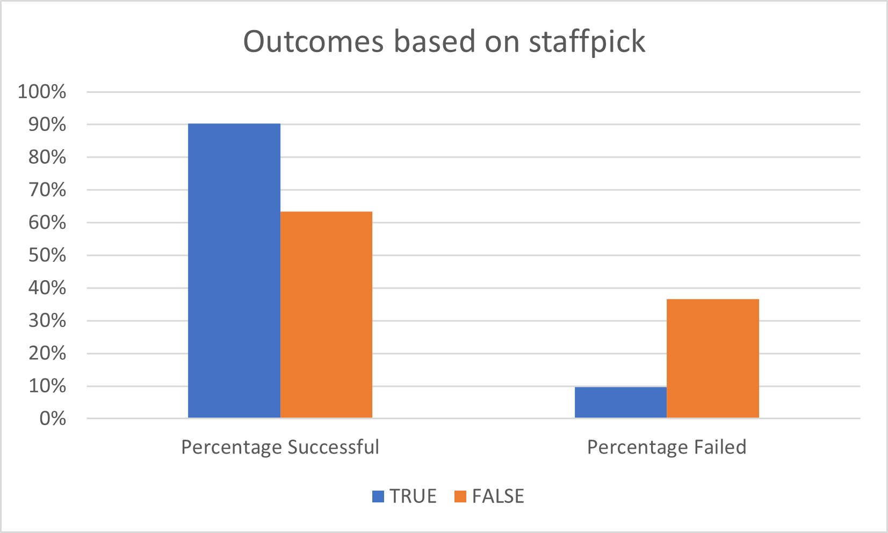
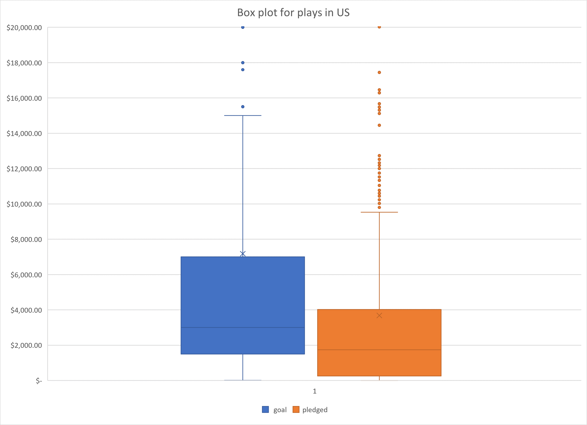

# Kickstarting with Excel
## Overview of Project
Louise is trying to raise money for her play Fever through crowd funding. Ther budget for the play is around 10k. The purpose of this challenge is to see if the fundraiser for Louise’s play Fever will be successful based on the data and trends from similar fundraisers that were held before. In this challenge we are trying to use excel to analyze the data. We have to analyze the outcomes based on launch date and goals and see if we can predict the outcome for Louise’s fundraiser.

## Analysis and Challenges
### Analysis of Outcomes Based on Launch Date
In this analysis we are trying to see if the events launch date is making a difference in the outcome. So we need to create a pivot table with parent category and the years as filters and rows being Date created conversion. The columns are the outcomes and the values are the count of outcomes. From this we create a line chart with each line being the counts for either successful or failed or canceled. We can filter the parent category to theater and select the years as All to look across different months for the theater category. 

### Analysis of Outcomes Based on Goals
We are trying to see if the outcomes changed with the goal amount. So we divide the goal amount into different ranges such as <1000, 1000-4999 etc. Using countifs function we count how many outcomes are successful for the subcategory “plays” and with the goal amount in that range. We need to sum all the successful, failed and canceled to get the total projects and calculate the % successful, % failed and % canceled. We then create a line chart to look at the outcomes % based on the goal amount. 

### Challenges and Difficulties Encountered
The data is large and is causing the excel to crash after a certain point.  So, it was hard to modify or save the existing workbook when I add more sheets or modify something. I had to remove the sheets we were not using for the final challenge to prevent it from crashing. 

## Results
### Results for outcomes based on Launch date
-Based on launch date May June and July are the most successful months for theater fundraisers. 
-During the end of the year and the beginning its dropping. 
Louise might be more successful if she launches her fundraiser during these months.

### Results for Outcomes based on Goals
Based on Goals the success rate was higher for low budget fundraisers uptil 5000$. But there are some fundraisers between 35+ to 45k which are also successful. Louise might be more successful if her budget is below 5000$. 

### Limitations of the dataset
The data has a category of theater and a subcategory called plays but there is no genre. We know the success rate for plays overall, but we do not know the genre of the successful plays. If we know which genre plays are more successful whether its comedy or romance or thrillers etc., we can figure out even more accurately how successful Louise might be in raising money for her play.

### Possible tables and graphs 
We can see if the play being a staff pick is more successful. For this I used countifs to count the successful plays based on whether it’s a staff pick or not. The play being a staff pick is making it 30% more succesful. So if Louises play is a staff pick she will have higher 

Also we can look at the box and whisker plots for pledged and goal amounts for the plays subcategory in US. Louise's budget of 10k is below the outlier range of the pledged amount and its also below the mean pledged amount of 11k

